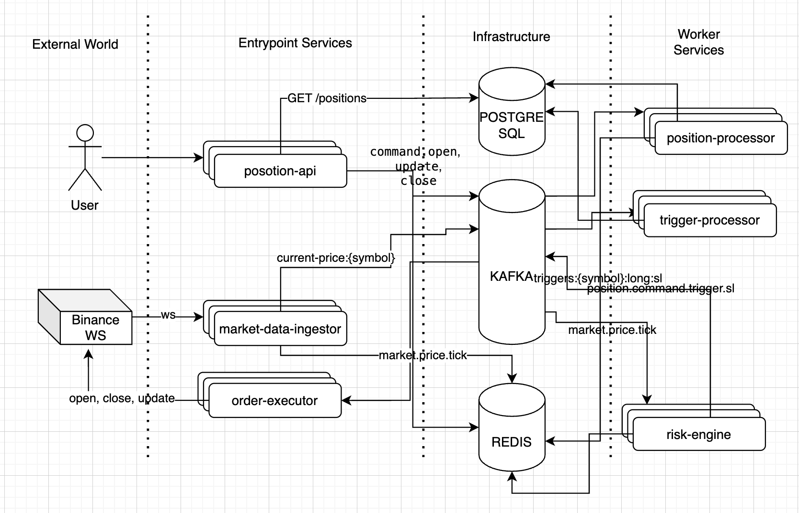

# Futures Engine

Event-driven microservices system for crypto futures positions processing using Kafka, Redis, and PostgreSQL.

## Table of Contents

- [Overview](#overview)
- [Architecture](#architecture)
- [Services](#services)
- [Kafka Topics](#kafka-topics)
- [Database Schema](#database-schema)
- [Redis Keys](#redis-keys)
- [Getting Started](#getting-started)
- [Docker Deployment](#docker-deployment)
- [Documentation](#documentation)

## Overview

**Futures Engine** is a scalable, event-driven platform for managing cryptocurrency futures positions. The MVP targets a single symbol (BTCUSDT) but the architecture is designed for horizontal scaling across multiple symbols and users.

### Key Principles

- **Hot path optimization**: Price-to-trigger processing avoids SQL queries, using Redis exclusively
- **PostgreSQL as source of truth**: All position data persists in PostgreSQL with full audit trail
- **Event-driven architecture**: All services communicate via Kafka for decoupling and scalability
- **At-least-once semantics**: All consumers are idempotent to handle message replays

## Architecture

### System Architecture Diagram



### Data Flow

1. **Market Data Ingestion**: Binance WebSocket → `market-data-ingestor` → Kafka (`market.price.tick`) + Redis (`current-price`)
2. **Position Opening**: REST API → Kafka (`position.command.open`) → `position-processor` → PostgreSQL + Redis (triggers)
3. **Trigger Detection**: Kafka ticks → `risk-engine` → Redis ZSET queries → Kafka (`position.command.trigger.*`)
4. **Position Closure**: Trigger commands → `trigger-processor` → PostgreSQL (close + PnL) + Redis (cleanup)
5. **Order Execution**: Kafka (`order.command.*`) → `order-executor` → Binance Trading API → Kafka (`order.event.*`)

### Technology Stack

| Component | Technology |
|-----------|-----------|
| **Runtime** | Node.js 22 (NestJS) |
| **Messaging** | Apache Kafka 7.5 |
| **Hot State** | Redis 7 |
| **Database** | PostgreSQL 15 |
| **Market Data** | Binance WebSocket API |
| **Containerization** | Docker & Docker Compose |

## Services

### position-api

**REST API** service for managing positions.

- **Responsibilities**:
  - Expose REST endpoints for position operations
  - Emit commands to Kafka (no direct writes)
  - Query positions from PostgreSQL and Redis
  - Compute live PnL using Redis current prices
- **Port**: `3001`
- **Endpoints**:
  - `POST /positions` - Open position
  - `PATCH /positions/:id` - Update triggers (SL/TP)
  - `DELETE /positions/:id` - Close position
  - `GET /positions` - List positions with live PnL
  - `GET /health` - Health check

### order-executor

**External order execution service.**

-   **Responsibilities**:
    -   Consume order commands from Kafka.
    -   Communicate with Binance Trading API to place, cancel, or modify orders (e.g., open, close, update).
    -   Handle Binance API responses and potential errors.
    -   Emit order execution events (success/failure) back to Kafka.
    -   Manage API rate limits and connection stability with Binance.
-   **Consumes**: `order.command.{create|cancel|modify}` (e.g., `order.command.create.market`, `order.command.create.limit`)
-   **Produces**: `order.event.{executed|failed|status.update}`

### market-data-ingestor

**Headless service** for ingesting real-time market data.

- **Responsibilities**:
  - Connect to Binance WebSocket for price feeds
  - Publish price ticks to Kafka (`market.price.tick`)
  - Write current price to Redis with 60s TTL
- **Symbols**: Configurable via `SYMBOLS` env var (default: BTCUSDT)

### position-processor

**Event processor** for position lifecycle management.

- **Responsibilities**:
  - Process position commands from Kafka
  - Write position data to PostgreSQL
  - Maintain Redis trigger indices (ZSETs)
  - Emit position events
- **Consumes**: `position.command.{open|update|close}`
- **Produces**: `position.event.{opened|updated}`

### risk-engine

**Real-time trigger detection** service *(in development)*.

- **Responsibilities**:
  - Consume price ticks from Kafka
  - Query Redis ZSETs for triggered positions
  - Emit trigger commands for SL/TP/Liquidation
- **Consumes**: `market.price.tick`
- **Produces**: `position.command.trigger.{sl|tp|liq}`

### trigger-processor

**Trigger execution** service *(in development)*.

- **Responsibilities**:
  - Process trigger commands
  - Transactionally close positions in PostgreSQL
  - Compute and record PnL
  - Clear Redis triggers
  - Emit closed events
- **Consumes**: `position.command.trigger.*`
- **Produces**: `position.event.closed`

## Kafka Topics

### Topic Naming Convention

Topics follow the pattern: `{domain}.{type}.{action}`

- **domain**: Business domain (e.g., `market`, `position`)
- **type**: Message type (`command`, `event`, `tick`)
- **action**: Specific action or event name

### Topics Overview

| Topic | Producer | Consumer(s) | Partition Key | Retention |
|-------|----------|-------------|---------------|-----------|
| `market.price.tick` | market-data-ingestor | risk-engine | `symbol` | 24h |
| `position.command.open` | position-api | position-processor | `userId` | 7d |
| `position.command.update` | position-api | position-processor | `positionId` | 7d |
| `position.command.close` | position-api | position-processor | `positionId` | 7d |
| `position.command.trigger.sl` | risk-engine | trigger-processor | `positionId` | 7d |
| `position.command.trigger.tp` | risk-engine | trigger-processor | `positionId` | 7d |
| `position.command.trigger.liq` | risk-engine | trigger-processor | `positionId` | 7d |
| `position.event.opened` | position-processor | analytics (optional) | `positionId` | 30d |
| `position.event.updated` | position-processor | analytics (optional) | `positionId` | 30d |
| `position.event.closed` | trigger-processor | analytics (optional) | `positionId` | 30d |

### Message Format Example

**market.price.tick**:
```json
{
  "key": "BTCUSDT",
  "value": {
    "symbol": "BTCUSDT",
    "price": "50123.45",
    "ts": 1704096000000
  }
}
```

**position.command.open**:
```json
{
  "key": "550e8400-e29b-41d4-a716-446655440000",
  "value": {
    "positionId": "a1b2c3d4-e5f6-7890-abcd-ef1234567890",
    "userId": "550e8400-e29b-41d4-a716-446655440000",
    "symbol": "BTCUSDT",
    "side": "LONG",
    "leverage": 10,
    "sizeContracts": "0.1",
    "entryPrice": "50000.00",
    "stopLossPrice": "49000.00",
    "takeProfitPrice": "52000.00"
  },
  "headers": {
    "x-correlation-id": "a1b2c3d4-e5f6-7890-abcd-ef1234567890"
  }
}
```

For detailed topic specifications

## Database Schema

### positions table

Stores all positions with their current state.

```sql
CREATE TABLE positions (
  position_id UUID PRIMARY KEY DEFAULT gen_random_uuid(),
  user_id UUID NOT NULL,
  symbol VARCHAR(20) NOT NULL,
  status VARCHAR(10) NOT NULL CHECK (status IN ('OPEN', 'CLOSED')),
  side VARCHAR(10) NOT NULL CHECK (side IN ('LONG', 'SHORT')),
  leverage INTEGER NOT NULL CHECK (leverage >= 1),
  size_contracts NUMERIC(38,10) NOT NULL,
  entry_price NUMERIC(38,10) NOT NULL,
  stop_loss_price NUMERIC(38,10),
  take_profit_price NUMERIC(38,10),
  liquidation_price NUMERIC(38,10) NOT NULL,
  close_price NUMERIC(38,10),
  pnl NUMERIC(38,10),
  close_reason VARCHAR(20),
  created_at TIMESTAMPTZ NOT NULL DEFAULT now(),
  updated_at TIMESTAMPTZ NOT NULL DEFAULT now(),
  closed_at TIMESTAMPTZ
);

CREATE INDEX idx_positions_user_status ON positions (user_id, status);
CREATE INDEX idx_positions_symbol_status ON positions (symbol, status);
```

### position_history table

Audit trail for all position-related events.

```sql
CREATE TABLE position_history (
  history_id BIGSERIAL PRIMARY KEY,
  position_id UUID NOT NULL REFERENCES positions(position_id) ON DELETE CASCADE,
  timestamp TIMESTAMPTZ NOT NULL DEFAULT now(),
  event_type VARCHAR(20) NOT NULL,
  details JSONB
);

CREATE INDEX idx_position_history_position_id ON position_history (position_id);
CREATE INDEX idx_position_history_timestamp ON position_history (timestamp DESC);
```

### Migrations

Apply migrations using:

```bash
./scripts/db-apply.sh
```

For detailed schema documentation, see [docs/schema.md](docs/schema.md).

## Redis Keys

### Current Price Cache

```
current-price:{symbol}  # String, TTL: 60s
```

**Example**: `current-price:BTCUSDT` → `"50123.45"`

### Trigger Indices (ZSETs)

Redis sorted sets with **score = price**, **member = positionId**:

```
triggers:{symbol}:long:sl      # Long stop-loss
triggers:{symbol}:long:tp      # Long take-profit
triggers:{symbol}:long:liq     # Long liquidation
triggers:{symbol}:short:sl     # Short stop-loss
triggers:{symbol}:short:tp     # Short take-profit
triggers:{symbol}:short:liq    # Short liquidation
```

### Query Patterns

For a given tick price **P**:

| Side | Trigger Type | Redis Query |
|------|--------------|-------------|
| LONG | Stop Loss | `ZREVRANGEBYSCORE triggers:BTCUSDT:long:sl P -inf` |
| LONG | Take Profit | `ZRANGEBYSCORE triggers:BTCUSDT:long:tp P +inf` |
| LONG | Liquidation | `ZREVRANGEBYSCORE triggers:BTCUSDT:long:liq P -inf` |
| SHORT | Stop Loss | `ZRANGEBYSCORE triggers:BTCUSDT:short:sl P +inf` |
| SHORT | Take Profit | `ZREVRANGEBYSCORE triggers:BTCUSDT:short:tp -inf P` |
| SHORT | Liquidation | `ZRANGEBYSCORE triggers:BTCUSDT:short:liq P +inf` |

## Getting Started

### Prerequisites

- **Node.js** >= 22.0.0
- **Docker** and **Docker Compose**
- Free ports: `5432` (PostgreSQL), `6379` (Redis), `9092` (Kafka), `2181` (Zookeeper), `3001` (API)

### Quick Start

```bash
# 1. Install dependencies
npm install

# 2. Start infrastructure (Kafka, Redis, PostgreSQL)
docker compose up -d

# 3. Wait for services to be healthy (~15 seconds)
docker compose ps

# 4. Apply database migrations
./scripts/db-apply.sh

# 5. Verify setup with smoke tests
npm run smoke
```

Expected output:
```
✓ Kafka test passed       (localhost:9092)
✓ Redis test passed       (localhost:6379)
✓ PostgreSQL test passed  (localhost:5432)

=== All Tests Passed ===
```

### Environment Variables

Create a `.env` file (or use defaults):

```bash
# Kafka
KAFKA_BROKERS=localhost:9092

# Redis
REDIS_URL=redis://localhost:6379

# PostgreSQL
PGHOST=localhost
PGPORT=5432
PGUSER=futures
PGPASSWORD=futures
PGDATABASE=futures

# Application
SYMBOLS=BTCUSDT
PRICE_TTL_SECONDS=60
PORT=3001
```

## Development

### Project Structure

```
futures-engine/
├── apps/                          # Microservices
│   ├── market-data-ingestor/     # Market data ingestion service
│   ├── position-api/             # REST API service
│   ├── position-processor/       # Position command processor
│   ├── risk-engine/              # Trigger detection service
│   └── trigger-processor/        # Trigger execution service
├── libs/                          # Shared libraries
│   ├── contracts/                # TypeScript message types
│   ├── kafka/                    # Kafka utilities
│   ├── redis/                    # Redis utilities
│   └── pg/                       # PostgreSQL utilities
├── migrations/                    # Database migrations
├── scripts/                       # Utility scripts
└── docs/                         # Documentation

```

### Running Services Locally

```bash
# Build all workspaces
npm run build

# Run specific service
npm run dev --workspace apps/market-data-ingestor
npm run dev --workspace apps/position-api
npm run dev --workspace apps/position-processor

# Or use environment-specific configs
KAFKA_BROKERS=localhost:9092 REDIS_URL=redis://localhost:6379 \
  npm run dev --workspace apps/market-data-ingestor
```

### Running Tests

```bash
# Smoke tests (integration with infrastructure)
npm run smoke

# Individual service tests (when implemented)
npm test --workspace apps/position-api
```

## Docker Deployment

### Build and Run All Services

```bash
# Build Docker images
docker compose build

# Start all services
docker compose up -d

# View logs
docker compose logs -f

# Check service health
docker compose ps
```

### Services in Docker Compose

- **zookeeper** - Kafka coordination service
- **kafka** - Message broker
- **redis** - Hot state and caching
- **postgres** - Persistent storage
- **market-data-ingestor** - Market data service
- **position-api** - REST API (accessible at `http://localhost:3001`)
- **position-processor** - Event processor

### Stop and Cleanup

```bash
# Stop services
docker compose down

# Stop and remove volumes (data loss!)
docker compose down -v
```

## Key Design Decisions

### Why Redis for Hot Path?

Trigger detection must handle high-frequency price ticks (potentially hundreds per second). Redis sorted sets (ZSETs) enable O(log N) queries for price-based ranges, keeping latency under 1ms vs 10-50ms for SQL queries.

### Why Kafka?

Event-driven architecture with Kafka provides:
- **Decoupling**: Services evolve independently
- **Scalability**: Horizontal scaling via consumer groups
- **Durability**: Messages persist for replay and debugging
- **Ordering**: Partition keys ensure order per symbol/user/position

### Idempotency

All message consumers are idempotent using:
- Position IDs as deduplication keys
- Database constraints (unique position_id)
- Conditional updates checking current state

At-least-once delivery means consumers may see duplicates - idempotency handles this gracefully.


### Database Migration Failures

```bash
# Check PostgreSQL logs
docker compose logs postgres

# Manually connect to database
psql -h localhost -U futures -d futures -W

# Re-run migrations
./scripts/db-apply.sh
```

### Redis Connection Issues

```bash
# Test Redis connectivity
redis-cli -h localhost -p 6379 ping

# Check Redis logs
docker compose logs redis
```

## License

MIT

---

**Status**: MVP in active development. Core services (market-data-ingestor, position-api, position-processor) are functional. risk-engine and trigger-processor are under development.
